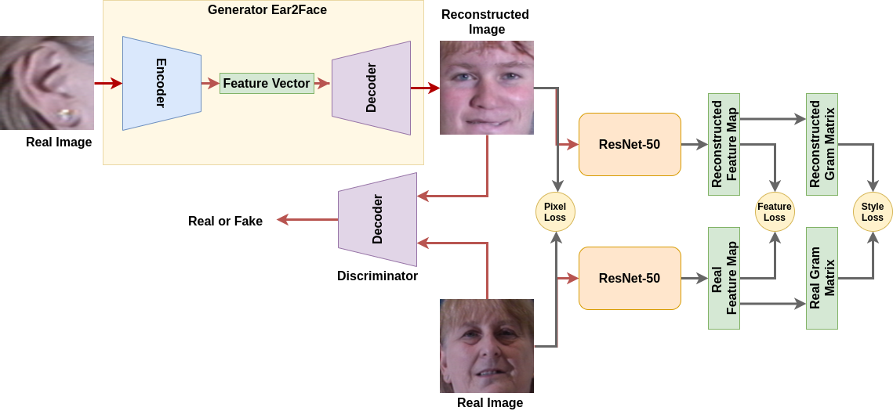
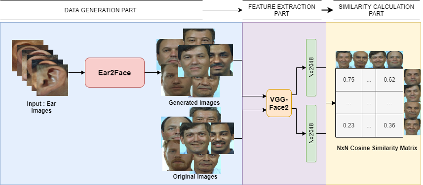

# Ear2Face: Deep Biometric Modality Mapping

This is the GitHub repository of our preliminary work on deep biometric modality mapping. In human nature, genotype is one of the main factors that determines the face [1, 2, 3, 4] and other biometric parts. Several works have shown that the relationship between DNA information and face appearance can be established [1, 2, 3, 4, 5, 6]. Since both ear and face are biometric traits of an individual and their phenotypes are generated based on genotypes, we expect an implicit relationship between ear and face through genetic knowledge [3, 4, 5, 6]. These previous works have motivated us to investigate the correlation between different visual biometric modalities, namely, ear and face, and learn a mapping between them in order to have a cross-modal biometric identification system. Please note that, since the used datasets are relatively small and have low variance, there is obviously a "dataset fit" problem. However, although there is a kind of dataset bias problem, the results are still promising as the relationship between ear and face can be learnt via generative models even if for a specific dataset.

The other interesting point is that the model can generate glasses and/or emotions. However, these things are not reconstructed correctly for all images. Probably, one of the main reason is low variance in the dataset. Therefore, the GAN model learns several certain variances to generate the data.

Please cite our paper, if it is helpful for your research.

```
@article{yaman2020ear2face,
  title={Ear2Face: Deep Biometric Modality Mapping},
  author={Yaman, Dogucan and Eyiokur, Fevziye Irem and Ekenel, Haz{\i}m Kemal},
  journal={arXiv preprint arXiv:2006.01943},
  year={2020}
}
```

## How did we create train and test sets?

First of all, we executed OpenCV [7] ear detector to capture ear images and Dlib [8] face detector to capture frontal face images. Then, we decided to select 10% percent of subjects for using in subject independent test set. The corresponding datasets and setups are presented in the table below.

Dataset | # of subject in training set | # of images in training set | # of subject in test set | # of images in test set | Test set name 
--- | --- | --- | --- | --- | --- 
Multi-PIE | 240 | 6544 | 240 | 1677 | Subject dependent test set 1
Multi-PIE | 240 | 6544 | 10 | 95 | Subject dependent test set 2
Multi-PIE | 240 | 6544 | 10 | 312 | Subject independent
FERET | 504 | 623 | 504 | 504 | Subject dependent test set 1 
FERET | 504 | 623 | 55 | 55 | Subject dependent test set 2
FERET | 504 | 623 | 55 | 55 | Subject independent 

### Multi-PIE [9]

### FERET [10]

## Methodology

In the Fig. 1, we present our system to learn mapping between two different biometric modalities which are ear and face. Moreover, in Fig. 2, we show our pipeline to perform face recognition using reconstructed face images and real face images in order to compare identification performance since preserving identity information is crucial for our task.



Fig. 1: Image-to-image translation pipeline.

------



Fig. 2: Face recognition pipeline using reconstructed and real face images.

## Results

## Discussion

Dataset bias

## Notes

1 - The reconstructed face images in Fig. 1 is not reconstructed version of input ear. The input and output images in Fig. 1 are selected randomly in order to basically represent just process. However, the images in Fig. 4 are generated by our model using test data. As mentioned in the paper, the subjects in the subject dependent test set 1 and 2 exist in the training data. However, the images are not the same. Moreover, the subjects in the subject independent test set do not exist in the training set. So, the model has not seen them.

2 - We will upload more reconstructed examples (failure cases as well as cross-dataset reconstructions).

3 - The related information for training & test data will be provided soon.

4 - This preliminary work is done in 2019 while authors were students at Istanbul Technical University (ITU), Istanbul, Turkey.

## References

[1] Peng, Shouneng, et al. "Detecting genetic association of common human facial morphological variation using high density 3D image registration." PLoS computational biology 9.12 (2013).

[2] Claes, Peter, et al. "Modeling 3D facial shape from DNA." PLoS genetics 10.3 (2014).

[3] Richmond, Stephen, et al. "Facial genetics: a brief overview." Frontiers in genetics 9 (2018): 462.

[4] Srinivas, Nisha, et al. "DNA2FACE: An approach to correlating 3D facial structure and DNA." 2017 IEEE International Joint Conference on Biometrics (IJCB), IEEE, 2017.

[5] Crouch, Daniel JM, et al. "Genetics of the human face: Identification of large-effect single gene variants." Proceedings of the National Academy of Sciences 115.4 (2018): E676-E685.

[6] Sero, Dzemila, et al. "Facial recognition from DNA using face-to-DNA classifiers." Nature communications 10.1 (2019): 2557.

[7] Bradski, Gary, and Adrian Kaehler. "OpenCV." Dr. Dobb’s journal of software tools 3 (2000).

[8] King, Davis E. "Dlib-ml: A machine learning toolkit." Journal of Machine Learning Research 10.Jul (2009): 1755-1758.

[9] Gross, Ralph, et al. "Multi-pie." Image and Vision Computing 28.5 (2010): 807-813.

[10] Phillips, P. Jonathon, et al. "The FERET evaluation methodology for face-recognition algorithms." IEEE Transactions on pattern analysis and machine intelligence 22.10 (2000): 1090-1104.
